# OutLook

这是一款burp插件，用于Outlook用户信息收集，在已登录Outlook账号后，可以使用该

插件自动爬取所有联系人的信息

# 安装

在burp扩展面板加载jar即可

# 功能介绍

## All Users

加载插件后，进入Outlook联系人面板，点击All Users

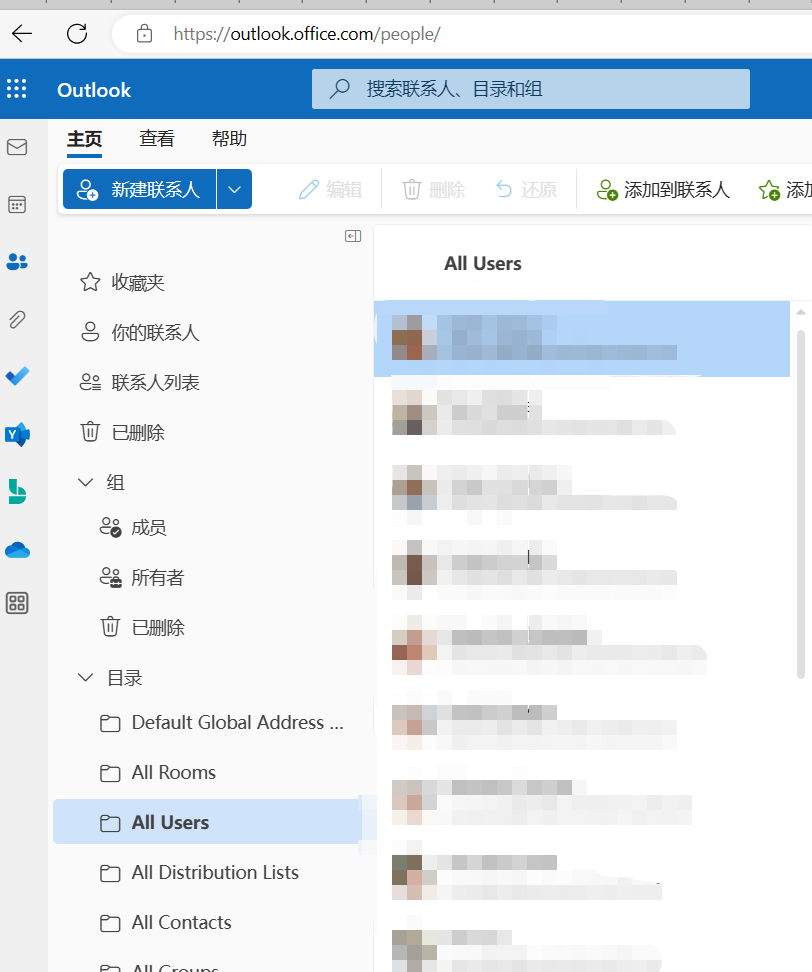

在burp中 Proxy -> HTTP history 筛选api接口

```
/owa/service.svc?action=FindPeople&app=People
```

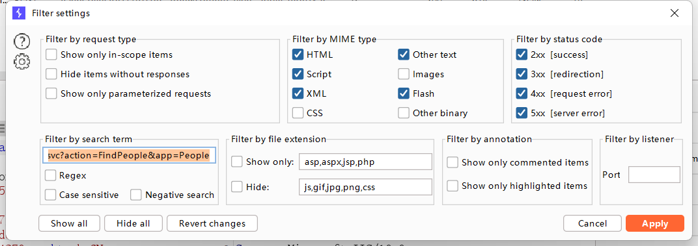

选中该请求，右键菜单 Extensions -> OutLook information collection -> Do OoutLook Email scan

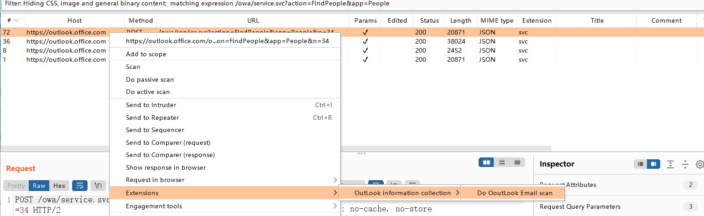

会在  Extender ->  Extensions -> OutLook information collection -> Output 中显示扫描进度


插件会自动爬取所有数据包并生成目录树，可以查看每一个请求响应包

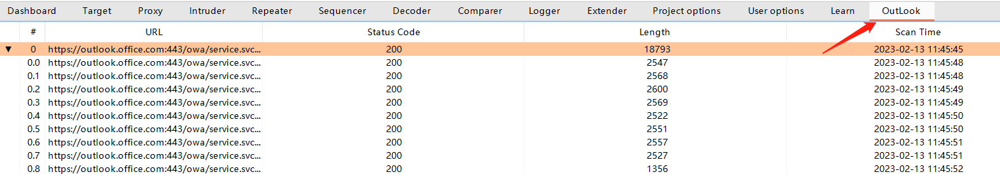

右击该请求会弹出右键菜单，选择获取所有用户邮箱，即可获得所有的邮箱

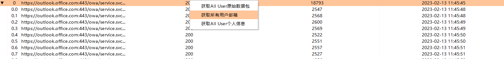

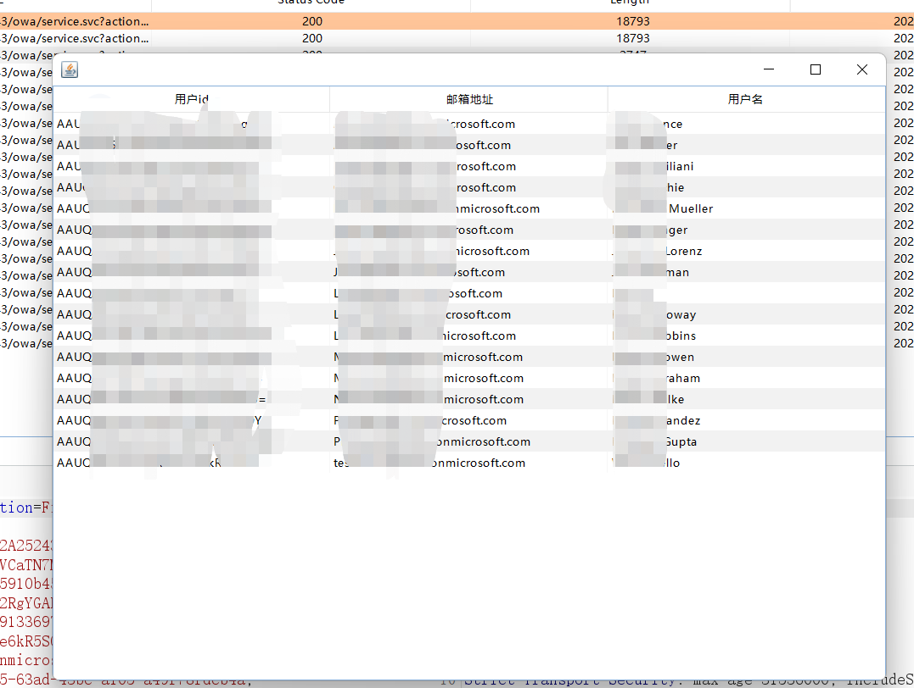

## 联系人信息

**必须在加载 All Users的所有数据包才能正常使用，联系人信息基于All Users数据包信息，如果未进行第一步操作会有弹窗提醒**


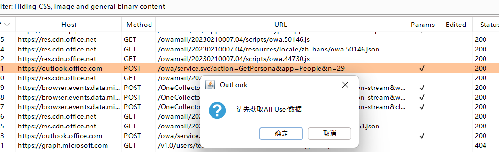

在burp中 Proxy -> HTTP history 筛选api接口

```
/owa/service.svc?action=GetPersona&app=People
```


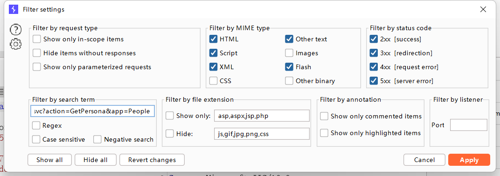

选中该请求，右键菜单 Extensions -> OutLook information collection -> Do OoutLook Email scan

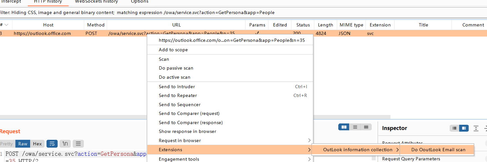

会在  Extender -> Extensions -> OutLook information collection -> Output 中显示扫描进度

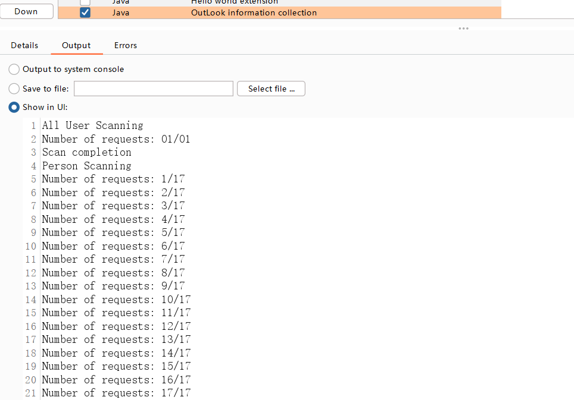

插件会自动爬取所有数据包并生成目录树，可以查看每一个请求响应包

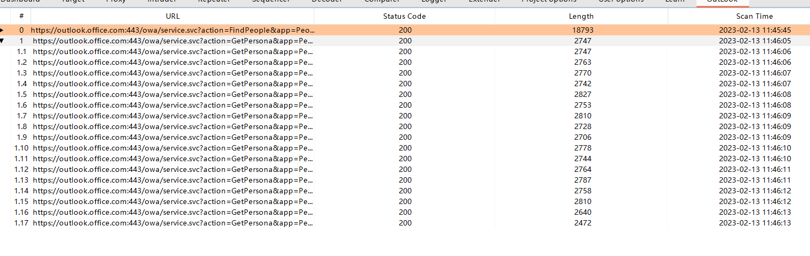

右击该请求会弹出右键菜单，选择获取 All User个人信息，可获取所有联系人信息

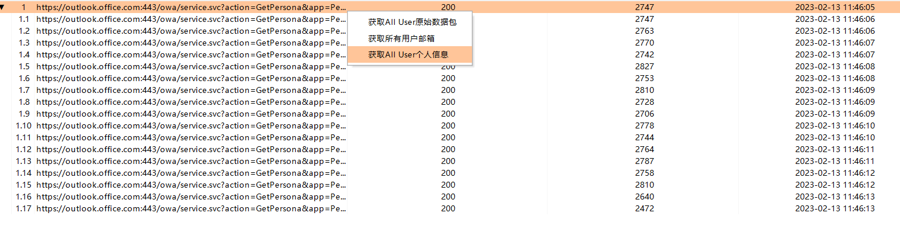

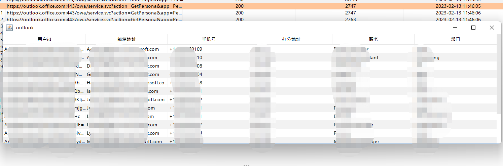

# 更新

[+] 2023.2.16 

+ 优化代码
+ 新增ALL User邮箱显示面板
+ 新增Output输出信息，便于查看当前扫描进度
+ 优化使用体验，只获取 *联系人信息*  会有弹窗提醒先进行 *All Users* 操作

# 免责声明

本工具仅面向**合法授权**的企业安全建设行为，如您需要测试本工具的可用性，请自行搭建靶机环境。

在使用本工具进行检测时，您应确保该行为符合当地的法律法规，并且已经取得了足够的授权。**请勿对非授权目标进行扫描。**

如您在使用本工具的过程中存在任何非法行为，您需自行承担相应后果，我们将不承担任何法律及连带责任。

在安装并使用本工具前，请您**务必审慎阅读、充分理解各条款内容**，限制、免责条款或者其他涉及您重大权益的条款可能会以加粗、加下划线等形式提示您重点注意。 除非您已充分阅读、完全理解并接受本协议所有条款，否则，请您不要安装并使用本工具。您的使用行为或者您以其他任何明示或者默示方式表示接受本协议的，即视为您已阅读并同意本协议的约束。