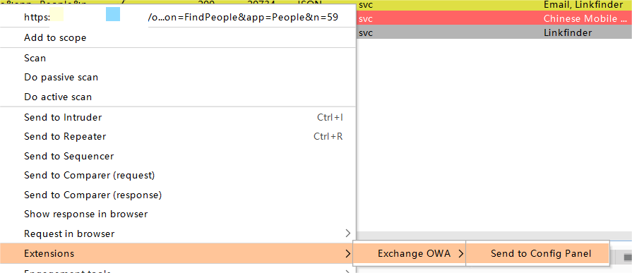
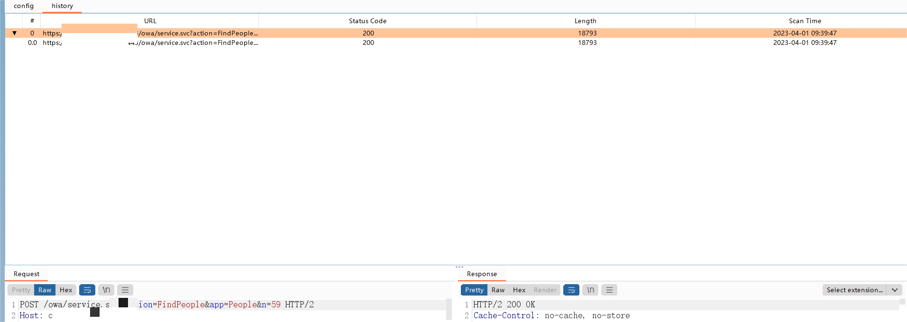
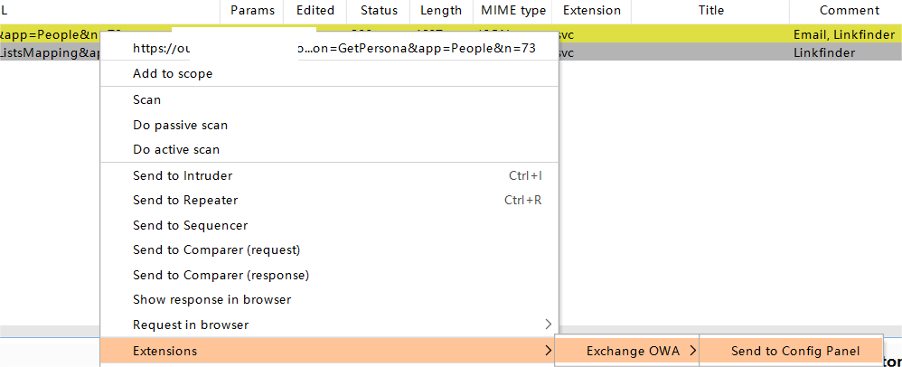
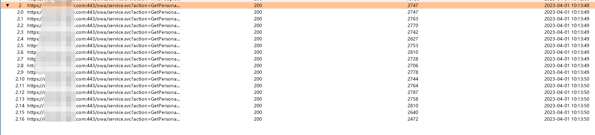

# ExchangeOWA

这是一款burp插件，用于Outlook 网页版用户信息收集，在已登录Outlook 网页版账号后，可以使用该

插件自动爬取所有联系人的信息，快速收集目标所有邮箱和个人信息

目前支持版本：V2013、V2018_01_08

# 安装

在burp扩展面板加载jar即可

# 功能介绍

## FindPeople

加载插件后，进入Outlook 网页版联系人面板，点击All Users


在burp中 Proxy -> HTTP history 筛选api接口

```
/owa/service.svc?action=FindPeople&app=People
```


我们可以发现，筛选出来还是有很多条，我们要选中正确的那条（返回包里面有TotalNumberOfPeopleInView字段）


选中该请求，右键菜单 Extensions -> Exchange OWA -> Send to Config Panel 




进入到我们的插件OWA -> config 面板，这里面配置我们的exchange服务器版本，因为不同版本的请求包会有细微的差别，我们可以通过version调整我们的版本，然后action选中FindPeople


点击开始，会在下方result面板输出我们的进度，默认是5线程，使用ThreadPoolExecutor创建的线程池，任务完成后会自动销毁，也可以点击停止终止并销毁所有线程池


我们进入到history面板，插件会自动爬取所有数据包并生成目录树，可以查看每一个请求响应包



右击该请求会弹出右键菜单，点击解析FindPeople数据包，会弹出窗体，把数据格式化表格输出


### 注意

该Api会有大量相同url，不同的Post提交参数，如果选错了Api接口，会有弹窗提示


## GetPersona

**必须在加载 FindPeople 的所有数据包才能正常使用，GetPersona 基于FindPeople数据包信息，如果未进行第一步操作会有弹窗提醒**


在burp中 Proxy -> HTTP history 筛选api接口

```
/owa/service.svc?action=GetPersona&app=People
```


选中该请求，右键菜单 Extensions -> ExchangeOWA -> Send to Config Panel



进入到我们的插件OWA -> config 面板，这里面配置我们的exchange服务器版本和action选项为GetPersona，点击开始，就会自动获取数据


进入到history面板，插件会自动解析所有数据包并生成目录树，可以查看每一个请求响应包



右击该请求会弹出右键菜单，选择解析GetPersona，可自动解析该数据包的内容


## 数据保存

在数据展示面板，可以在表格任意位置，右键导出数据到表格，会自动生成表格在burp当前目录，文件名使用UUID，不用担心重复，除非你是欧皇φ(*￣0￣)


# 更新

[+] 2023.5.23

+ 修复数据展示空指针异常

[+] 2023.4.1

+ 重构项目，兼容更多的exchange版本
+ 支持2018、2013，更多版本在实战遇到会添加，也欢迎大家提交样本集成进去
+ 重写UI面板和操作方式，进一步优化
+ 新增多线程操作，可以提高效率

[+] 2023.2.17

+ 优化代码和操作界面
+ 新增数据保存功能，导出格式为xls

[+] 2023.2.16 

+ 优化代码,修复bug
+ 新增ALL User邮箱显示面板
+ 新增Output输出信息，便于查看当前扫描进度
+ 优化使用体验，只获取 *联系人信息*  会有弹窗提醒先进行 *All Users* 操作

# 免责声明

本工具仅面向**合法授权**的企业安全建设行为，如您需要测试本工具的可用性，请自行搭建靶机环境。

在使用本工具进行检测时，您应确保该行为符合当地的法律法规，并且已经取得了足够的授权。**请勿对非授权目标进行扫描。**

如您在使用本工具的过程中存在任何非法行为，您需自行承担相应后果，我们将不承担任何法律及连带责任。

在安装并使用本工具前，请您**务必审慎阅读、充分理解各条款内容**，限制、免责条款或者其他涉及您重大权益的条款可能会以加粗、加下划线等形式提示您重点注意。 除非您已充分阅读、完全理解并接受本协议所有条款，否则，请您不要安装并使用本工具。您的使用行为或者您以其他任何明示或者默示方式表示接受本协议的，即视为您已阅读并同意本协议的约束。